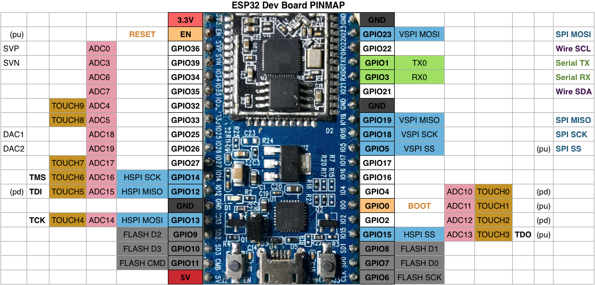

Arduino core for ESP32 WiFi chip
===========================================

### Development Status
Not everything is working yet, you can not get it through package manager, but you can give it a go and help us find bugs in the things that are implemented :)

The framework can also be downloaded as component in an IDF project and be used like that.

Things that "should" work:
- pinMode
- digitalRead/digitalWrite
- attachInterrupt/detachInterrupt
- Serial (global Serial is attached to pins 1 and 3 by default, there are another 2 serials that you can attach to any pin)
- SPI (global SPI is attached to VSPI pins by default and HSPI can be attached to any pins)
- Wire (global Wire is attached to pins 21 and 22 by default and there is another I2C bus that you can attach to any pins)
- WiFi (about 99% the same as ESP8266)

WiFiClient, WiFiServer and WiFiUdp are not quite ready yet because there are still some small hiccups in LwIP to be overcome.
You can try WiFiClient but you need to disconnect the client yourself to be sure that connection is closed.

### Installation

####[Instructions for Windows](doc/windows.md)

#### Instructions for Mac
- Install latest Arduino IDE from [arduino.cc](https://www.arduino.cc/en/Main/Software)
- Open Terminal and execute the following command (copy->paste and hit enter):

  ```bash
  curl -o get-pip.py https://bootstrap.pypa.io/get-pip.py && \
  sudo python get-pip.py && \
  sudo pip install pyserial && \
  mkdir -p ~/Documents/Arduino/hardware/espressif && \
  cd ~/Documents/Arduino/hardware/espressif && \
  git clone https://github.com/espressif/arduino-esp32.git esp32 && \
  cd esp32/tools/ && \
  python get.py
  ```
- Restart Arduino IDE

#### Instructions for Debian/Ubuntu Linux
- Install latest Arduino IDE from [arduino.cc](https://www.arduino.cc/en/Main/Software)
- Open Terminal and execute the following command (copy->paste and hit enter):

  ```bash
  sudo usermod -a -G dialout $USER && \
  sudo apt-get install git && \
  wget https://bootstrap.pypa.io/get-pip.py && \
  sudo python get-pip.py && \
  sudo pip install pyserial && \
  mkdir -p ~/Arduino/hardware/espressif && \
  cd ~/Arduino/hardware/espressif && \
  git clone https://github.com/espressif/arduino-esp32.git esp32 && \
  cd esp32/tools/ && \
  python get.py
  ```
- Restart Arduino IDE


